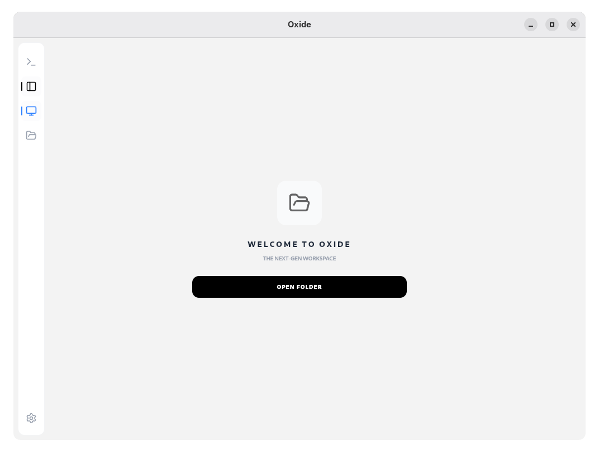

#  Oxide

<p align="center">
  
</p>

<p align="center">
  <a href="https://github.com/LetermeFlorent/Oxide/releases">
    
  </a>
  <a href="https://github.com/LetermeFlorent/Oxide/actions">
    
  </a>
</p>

---

## ⚙️ How it Works

**Oxide** is a high-performance developer workspace that bridges the gap between web flexibility and native power.

- **Hybrid Core**: The application uses **Tauri v2** to run a **React 19** frontend inside a native **Rust** container. This ensures minimal resource usage compared to traditional Electron apps.
- **Native Terminal (PTY)**: Unlike simple terminal emulators, Oxide uses a real PTY (Pseudo-Terminal) system in Rust. It spawns native processes (`bash` on Unix, `cmd.exe` on Windows) and streams the output directly to an Xterm.js frontend for maximum performance.
- **Smart Workspace**: Your project state, opened tabs, and terminal layout are managed by **Zustand** and automatically persisted on disk via a Rust backend using high-speed storage (LSM Sled).
- **Intelligent Rendering**: Oxide automatically detects file types to provide the best viewing experience, including **Monaco** for code, high-performance **PDF** rendering, and **Markdown** with live preview.
- **Task Automation**: If a `task.md` file is present in your project, Oxide tracks your progress automatically and displays it as a visual thermometer in the sidebar.

---

## 💻 Installation

To run or build Oxide from source, follow these steps.

### 1. Prerequisites
Ensure you have the following installed on your system:
- **Rust**: [Official Installation](https://www.rust-lang.org/tools/install)
- **Node.js**: Version 20 or higher
- **Tauri Dependencies**: Follow the [Tauri Setup Guide](https://tauri.app/v1/guides/getting-started/prerequisites) for your specific OS (Linux, macOS, or Windows).

### 2. Setup
```bash
# Clone the repository
git clone https://github.com/LetermeFlorent/Oxide.git

# Go to project folder
cd Oxide

# Install frontend and backend dependencies
npm install
```

### 3. Run Development Mode
This will launch the application with hot-reload for both React and Rust.
```bash
npm run tauri dev
```

### 4. Build for Production
To create a native installer for your platform:
```bash
npm run tauri build
```

---

## 🗺️ Current Status

- [x] **Cross-Platform PTY Support** (Windows/Linux/macOS)
- [x] **Glassmorphism UI**
- [x] **Integrated Markdown & PDF Engine**
- [x] **Automated Project Persistence**
- [ ] **Themes Engine (Light/Dark Mode)** (Planned)
- [ ] **Advanced File Tree Virtualization** (In Progress)
